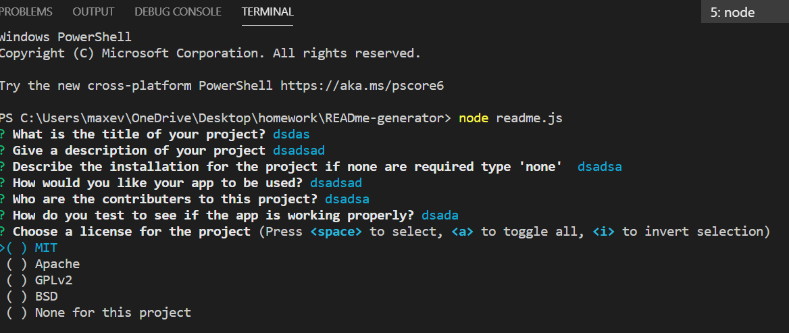
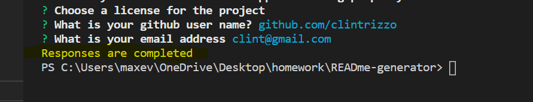

# READme Generator
    
#Table of Contents
    
- [READme Generator](#readme-generator)
  - [Description:](#description)
  - [Installation:](#installation)
  - [Usage:](#usage)
  - [Contributers:](#contributers)
  - [Test:](#test)
  - [Videos and Pictures](#videos-and-pictures)
  - [My-info:](#my-info)
    
## Description:

- Info on how the project works:
This application is a complete backend project using Node.JS (No deployed site). User can create a readme file using this app by going through their teriminal and answering a few questions
    
## Installation:
User must install node as well as inquirer, fs, and util for app to work correctly
    
## Usage:
This app is to help users create readme files and have an organized start to their readme files
    
## Contributers:
Clint Rizzo

## Test:
User can test the site by using bash or their terminal. User can also use the integrated teriminal in visual studios to test the app
    
## Videos and Pictures 
- [video](https://youtu.be/7fdDhJHIG8s)

- 
- 

## My-info:
For additional information or questions please reach out to my email: clint.rizzo92@gmail.com
